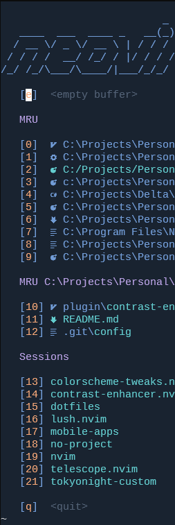
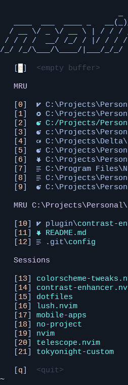
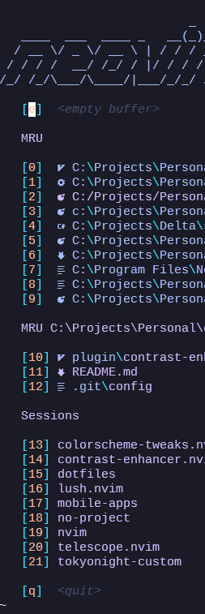

# Problem

There are a lot of really solid colorschemes available for neovim and vim alike, but many of them don't have the contrast between foreground and background colors that I like even if I appreciate the color pallete used to all of the different highlights.  Given the number of neovim plugins available and individual highlights requried to have a fully themed editor, I don't want to take the time to fully tweak a colorscheme to match everything I want.

# Solution

This project is an attempt to address the need of forking and updating a full colorscheme by allowing runtime manipulation of the highlights loaded by neovim.  By leveraging some prior art from existing themes (attributed below), this plugin reads the current seleections of `:highlight`, parses it for `guifg` and `guibg` colors, and shifts them brighter or darker, proportionally, based on whether or not their average RGB color channels are closer to white or black.

This gives the effect of increasing the contrast between the foreground and background colors, albeit at the cost of decreasing the contrast between colors that are on the same side of grey.

While I built this library with the intent of almost exclusively using it with `IncreaseContrast` and dark colorschemes, the math works just the same with light color schemes.

## Usage

`colorscheme-tweaks` exposes two different vim commands - `IncreaseContrast` and `DecreaseContrast` which can be invoked by providing them a numerical value between 0 and 1.  ( Providing a value of 1 will set all colors to either black or white. )

## Examples

### [nightfox](https://github.com/EdenEast/nightfox.nvim)

Original vs `:IncreaseContrast 0.3`

 

### [tokyonight](https://github.com/folke/tokyonight.nvim)

Original (storm) vs `:IncreaseContrast 0.2`

 

## Recommendations/Notes

* I recommend `0.2` as a step increment to see if you're headed in the right direction.
* Since this plugin doesn't modify the actual theme, if you've stepped too far, you can reload the original colors by simply calling `:colorscheme MY_COLORSCHEME` and then shift it again to your liking.
* Since this plugin proportionally moves colors closer towards #000000 and #FFFFFF, the result of calling `:IncreaseContrast 0.1` twice is not the same as `:IncreaseContrast 0.2`.

# Attributions

Much of the actual calculation code is borrowed from the brilliant [tokyonight.nvim](https://github.com/folke/tokyonight.nvim) which has some extensions available to brighten and darken colors by a percentage. I've extracted several of the util functions (and the whole of the [hsluv library](https://github.com/hsluv/hsluv-lua)) and am leveraging those for the actual color math.

